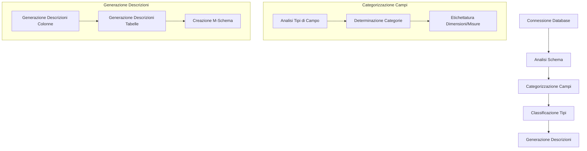

# XiYan-DBDescGen: Generatore Automatico di Descrizioni per Database

## Panoramica del Progetto

XiYan-DBDescGen è uno strumento sofisticato per la generazione automatica di descrizioni efficaci del database quando non sono disponibili descrizioni esplicite. Il progetto implementa un approccio a doppio processo:
- Processo da grossolano a fine
- Processo da fine a grossolano

Lo strumento supporta tre principali dialetti di database:
- SQLite
- MySQL
- PostgreSQL

## Componenti Principali

### 1. SchemaEngine (schema_engine.py)
Il componente centrale che orchestra l'intero processo di generazione delle descrizioni. Responsabilità principali:
- Connessione al database ed estrazione dei metadati
- Analisi dello schema e categorizzazione dei campi
- Generazione di descrizioni per tabelle e colonne
- Supporto alla generazione di query SQL

### 2. TypeEngine (type_engine.py)
Gestisce la categorizzazione e la validazione dei tipi di dati attraverso diversi dialetti di database. Caratteristiche:
- Supporto per molteplici dialetti SQL
- Categorizzazione dei tipi (Number, String, DateTime, Bool, Other)
- Classificazione delle categorie di campo (Code, Enum, DateTime, Text, Measure)
- Supporto per l'etichettatura Dimensione/Misura

### 3. Components (components.py)
Contiene le funzionalità core per la comprensione e la descrizione degli elementi del database:
- Comprensione dello schema del database
- Logica di categorizzazione dei campi
- Generazione di descrizioni per colonne e tabelle
- Analisi della granularità di date e orari

## Flusso Logico



## Funzionalità Chiave

### 1. Analisi Intelligente dei Campi
- Rilevamento automatico dei tipi e delle categorie dei campi
- Classificazione intelligente di dimensioni e misure
- Riconoscimento dei campi data/ora e della loro granularità

### 2. Supporto Multi-Dialetto
- Compatibile con i principali dialetti SQL (MySQL, PostgreSQL, SQLite)
- Gestione dei tipi specifici per dialetto
- Escape e quotazione appropriati per diversi dialetti

### 3. Generazione M-Schema
- Crea una rappresentazione completa dello schema
- Include relazioni e vincoli tra i campi
- Supporta metadati e descrizioni

### 4. Generazione di Descrizioni
- Descrizioni contestuali delle colonne
- Documentazione a livello di tabella
- Supporto per lingue italiana e inglese

### 5. Supporto Query SQL
- Capacità di generazione di query SQL di base
- Esecuzione di query e formattazione dei risultati
- Gestione degli errori e dei timeout

## Implementazione Tecnica

Il progetto utilizza diverse tecniche sofisticate:

1. **Sistema di Classificazione dei Tipi**
   - Categorizzazione gerarchica dei tipi
   - Mappatura dei tipi tra diversi dialetti
   - Inferenza personalizzata dei tipi

2. **Pipeline di Generazione Descrizioni**
   - Analisi e categorizzazione dei campi
   - Raccolta e comprensione del contesto
   - Generazione di descrizioni basata su LLM

3. **Gestione dello Schema**
   - Monitoraggio dei vincoli
   - Mappatura delle relazioni
   - Gestione dei metadati

## Configurazione

### File .env
Il progetto utilizza un file `.env` per la configurazione. Crea questo file nella radice del progetto:

```plaintext
# OpenRouter Configuration
OPENROUTER_API_KEY=your_api_key_here
OPENROUTER_MODEL=mistral-7b-instruct

# Optional Configuration
OPENROUTER_MAX_RETRIES=3
OPENROUTER_TIMEOUT=30
```

Un template del file `.env` è fornito come `.env.example`.

## Esempio di Utilizzo

```python
# 1. Creazione della connessione al database
db_engine = create_engine('sqlite:///your_database.db')

# 2. Configurazione OpenRouter LLM
from openrouter_llm import OpenRouterLLM

# Il client caricherà automaticamente la configurazione dal file .env
llm = OpenRouterLLM()

# Oppure puoi specificare i parametri direttamente
llm = OpenRouterLLM(
    api_key="your_api_key",
    model="mistral-7b-instruct",
    max_retries=3,
    timeout=30
)

# 3. Generazione delle descrizioni
schema_engine = SchemaEngine(db_engine, llm=llm, db_name='your_db_name')
schema_engine.fields_category()
schema_engine.table_and_column_desc_generation()

# 4. Accesso allo schema generato
mschema = schema_engine.mschema
mschema.save('./your_db.json')