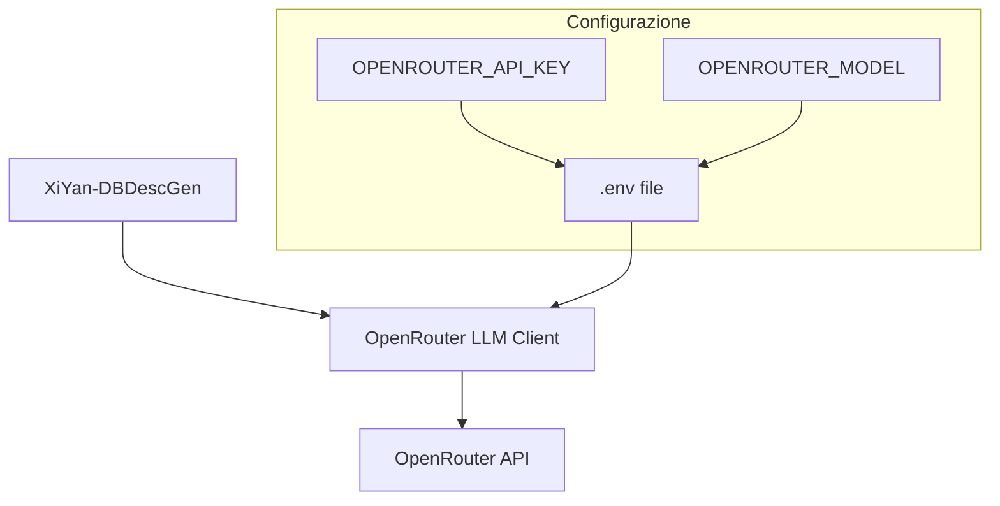

# Integrazione OpenRouter per XiYan-DBDescGen

## Panoramica
Questa documentazione descrive l'integrazione di OpenRouter come provider LLM per XiYan-DBDescGen, sostituendo l'implementazione DashScope precedente.

## Architettura della Soluzione



## Struttura dei File

1. **openrouter_llm.py**
   - Implementazione del client OpenRouter
   - Gestione della configurazione
   - Integrazione con llama-index

2. **.env**
   - File di configurazione per le variabili d'ambiente
   - Contiene API key e selezione del modello
   - Non versionato (incluso in .gitignore)

3. **.env.example**
   - Template per il file .env
   - Mostra la struttura richiesta delle variabili d'ambiente

## Configurazione

### File .env
```plaintext
OPENROUTER_API_KEY=your_api_key_here
OPENROUTER_MODEL=your_preferred_model
```

### File .env.example
```plaintext
OPENROUTER_API_KEY=
OPENROUTER_MODEL=mistral-7b-instruct
```

## Utilizzo

```python
# 1. Creazione della connessione al database
db_engine = create_engine('sqlite:///your_database.db')

# 2. Configurazione OpenRouter LLM
from openrouter_llm import OpenRouterLLM
llm = OpenRouterLLM()  # Carica automaticamente la configurazione da .env

# 3. Generazione delle descrizioni
schema_engine = SchemaEngine(db_engine, llm=llm, db_name='your_db_name')
schema_engine.fields_category()
schema_engine.table_and_column_desc_generation()
```

## Implementazione Proposta

Il file `openrouter_llm.py` dovrà implementare:

1. **Gestione Configurazione**
   - Caricamento automatico del file .env
   - Validazione delle variabili d'ambiente richieste

2. **Client OpenRouter**
   - Implementazione della classe OpenRouterLLM
   - Integrazione con l'interfaccia LLM di llama-index
   - Gestione delle chiamate API a OpenRouter

3. **Gestione Errori**
   - Validazione della configurazione
   - Gestione degli errori API
   - Retry logic per le chiamate fallite

## Sicurezza

1. **Gestione delle Chiavi API**
   - Le chiavi API sono memorizzate solo nel file .env
   - Il file .env è escluso dal controllo versione
   - Viene fornito un template .env.example

2. **Validazione**
   - Controllo della presenza delle variabili d'ambiente richieste
   - Validazione del formato della chiave API
   - Verifica del modello specificato

## Next Steps

1. Creare il file `openrouter_llm.py` con l'implementazione del client
2. Aggiungere il template `.env.example`
3. Aggiornare la documentazione principale del progetto
4. Implementare i test per il nuovo client
5. Aggiornare gli esempi esistenti

## Note per lo Sviluppo

Per procedere con l'implementazione, passare alla modalità Code utilizzando:

```python
<switch_mode>
<mode_slug>code</mode_slug>
<reason>Implementare il client OpenRouter e la configurazione</reason>
</switch_mode>